# HANDS 

## Authors
- All code by Dan Moore, danthemellowman, www.makeitdoathing.com, www.fakelove.tv
- Concepting for HANDS by Pablo Gnecco, yopablo, www.yopablo.com

## Description
###HANDS 

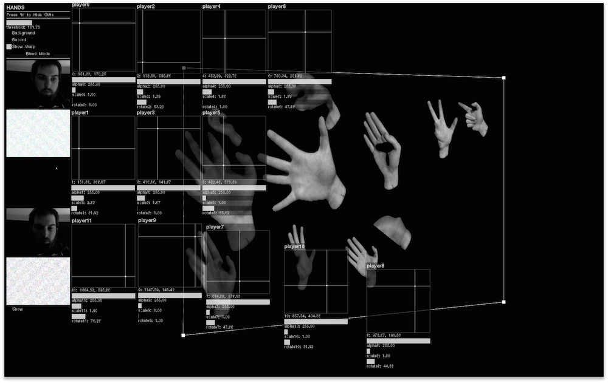

Is an explorations in movement, image processing, and gif encoding.  The installations allows participates to record a 3 second image sequence that is then played back on a large projection area.  The sequences are Looped and played back at different rates. A GIF of the users movements are saved for export. 

[Make It Do A Thing: HANDS](http://makeitdoathing.com/index.php/gifs/hands/)

###FULLSCREEN 

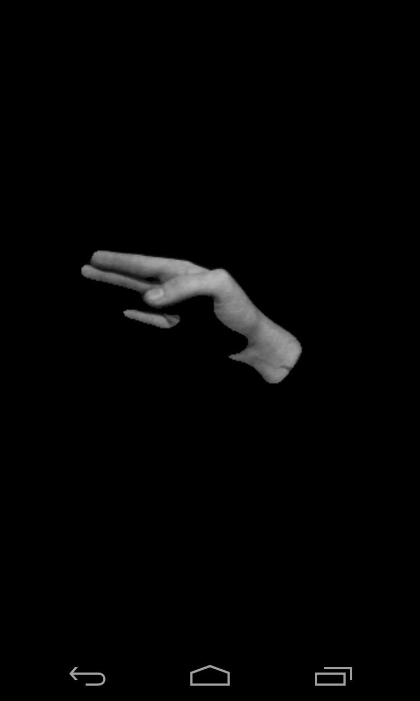

An Android app framework for turning any android device into a piece of Art.  The codebase is specifically designed to render an HTML Site, Video, or GIF and takeover the functionality of the home button.  The app also disallows the user to close or exit the app.  When paired with a Samsung Galaxy Gear Smart Watch the device becomes a wearable piece of Art.

FULLSCREEN was developed for Aram Bartholl's FULLSCREEN Group show at XPO Gallery

[Make It Do A Thing: FULLSCREEN](http://makeitdoathing.com/index.php/opensource/fullscreen/)

Using the exported GIFs from HANDS and The Android App framework from FULLSCREEN I created two Android apps currently on the Play Store.  

[Android Home App](https://play.google.com/store/apps/details?id=com.hand.fullscreen.home)

[Android App](https://play.google.com/store/apps/details?id=com.hand.fullscreen)

A Gallery exhibition of this work would involve a capture booth, a projection area, an exhibition area show selected captures on Android Tablets and Smart Watches.  These devices would no longer function as smart devices but exsits purely as peices of Art.  

## Links to External Libraries

[ofxQuadWarp](https://github.com/fakelove/ofxQuadWarp)

[ofxSimpleTimer](https://github.com/fakelove/ofxSimpleTimer)

[ofxWatchDog](https://github.com/toolbits/ofxWatchdog)

[ofxCv](https://github.com/kylemcdonald/ofxCv)

[ofxImageSequence](https://github.com/cwhitney/ofxImageSequence)

[ofxImageSequenceRecorder](https://github.com/atduskgreg/ofxImageSequenceRecorder)

[ofxGifEncoder](https://github.com/jesusgollonet/ofxGifEncoder)

[ofxUI](https://github.com/rezaali/ofxUI)

## Images & Videos

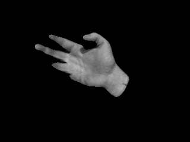

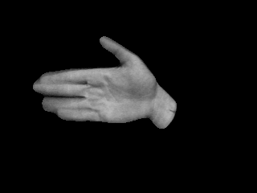
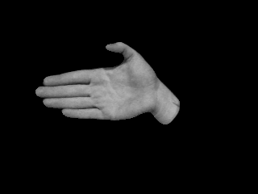
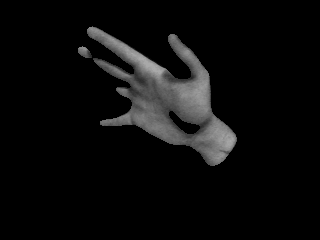
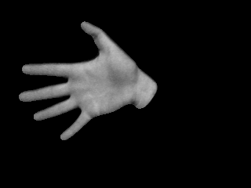
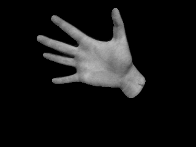
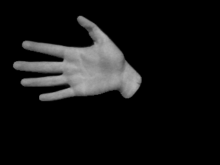
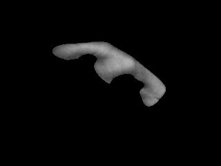
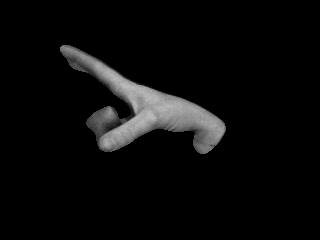
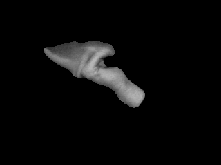

