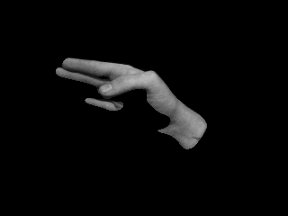

# HANDS and FULLSCREEN

## Authors
- All code by Dan Moore, danthemellowman, www.makeitdoathing.com, www.fakelove.tv
- Concepting for HANDS by Pablo Gnecco, yopablo, www.yopablo.com

## Description
###HANDS 
is an explorations in movement, image processing, and gif encoding.  The installations allows participates to record a 3 second image sequence that is then played back on a large projection area.  A GIF of the interaction is also exported.

[_Make It Do A Thing: HANDS_](http://makeitdoathing.com/index.php/gifs/hands/)

###FULLSCREEN 
is an Android app framework for turning any Android device into a piece of Art.  The codebase is specifically designed to takeover the functionality of the home button and disallow the user to close or exit the app.  When paired with a Samsung Galaxy Gear (gen 1) the device becomes a wearable piece of Art.

[_Make It Do A Thing: FULLSCREEN_](http://makeitdoathing.com/index.php/opensource/fullscreen/)

Using the exported GIFs from HANDS and the code base of FULLSCREEN I created two Android apps currently on the Play Store. 

[Android Home App](https://play.google.com/store/apps/details?id=com.hand.fullscreen.home)

[Android App](https://play.google.com/store/apps/details?id=com.hand.fullscreen)

## Links to External Libraries

[ofxQuadWarp](https://github.com/fakelove/ofxQuadWarp)

[ofxSimpleTimer](https://github.com/fakelove/ofxSimpleTimer)

[ofxWatchDog](https://github.com/toolbits/ofxWatchdog)

[ofxCv](https://github.com/kylemcdonald/ofxCv)

[ofxImageSequence](https://github.com/cwhitney/ofxImageSequence)

[ofxImageSequenceRecorder](https://github.com/atduskgreg/ofxImageSequenceRecorder)

[ofxGifEncoder](https://github.com/jesusgollonet/ofxGifEncoder)

[ofxUI](https://github.com/rezaali/ofxUI)

## Images & Videos

